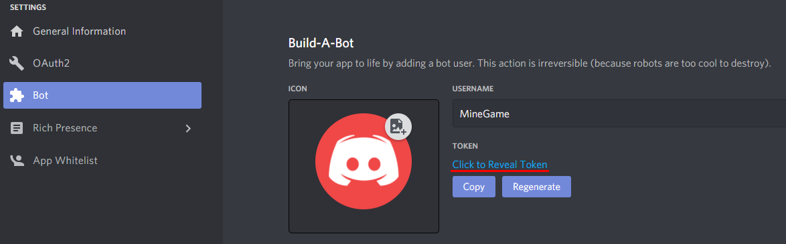
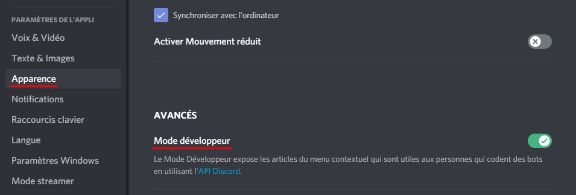
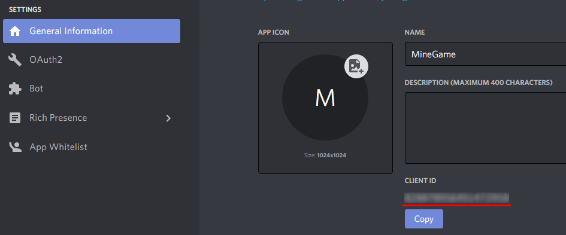

# Installation

Créer le dépôt :
```bash
git clone https://github.com/ClementBonnoron/MineGame.git
```
  
Installer Python3 : [https://www.python.org/downloads](https://www.python.org/downloads)  
  
Installer les bibliothèques nécessaires :  
```bash
python3 -m pip install -r requirements.txt
```
  
Lancer le bot :
```bash
python3 main.py
```

# Initialisation

Il est nécessaire de modifier le .env permettant de stocker les informations personnelles du bot : 

TOKEN correspond à l'identifiant du bot. Vous pouvez le récupérer sur la page de [développeur discord] (https://discord.com/developers/applications) :  
  
AUTHOR_ID correspond à l'identifiant du propriétaire du serveur. Les identifiants peuvent être récupéré en faisant clique droit sur les icones des
 personnes, en ayant activé le mode développeur :  
  
ADMIN est une liste d'identifiant séparé par des virgules contenant la liste des identifiants administrateurs.  
BOT_ID correspond à l'identifiant du bot :  
  

# .env

```
TOKEN=...
PREFIX=&
AUTHOR_ID=...
ADMIN=...
BOT_ID=...
EXTENSION=cogs.cog_admin,cogs.cog_info,cogs.cog_user
FILE_USERS=users.json
```